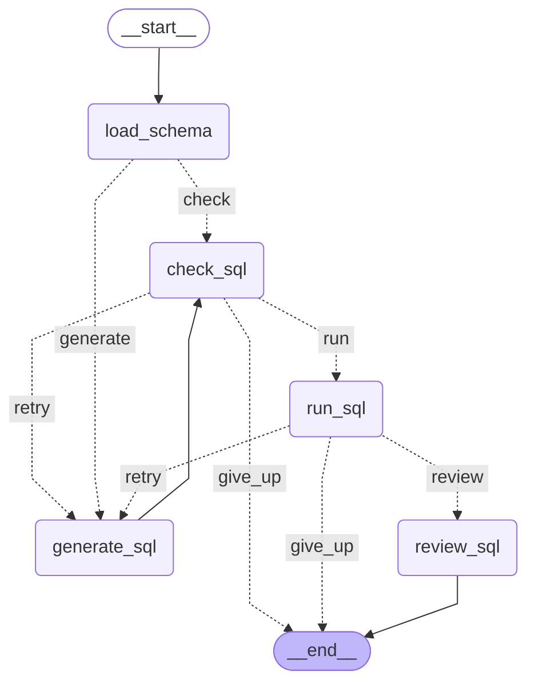

# SQL agent graph

```mermaid
---
config:
  flowchart:
    curve: linear
---
graph TD;
	__start__([<p>__start__</p>]):::first
	load_schema(load_schema)
	generate_sql(generate_sql)
	check_sql(check_sql)
	run_sql(run_sql)
	review_sql(review_sql)
	__end__([<p>__end__</p>]):::last
	__start__ --> load_schema;
	check_sql -. &nbsp;give_up&nbsp; .-> __end__;
	check_sql -. &nbsp;retry&nbsp; .-> generate_sql;
	check_sql -. &nbsp;run&nbsp; .-> run_sql;
	generate_sql --> check_sql;
	load_schema -. &nbsp;check&nbsp; .-> check_sql;
	load_schema -. &nbsp;generate&nbsp; .-> generate_sql;
	run_sql -. &nbsp;give_up&nbsp; .-> __end__;
	run_sql -. &nbsp;retry&nbsp; .-> generate_sql;
	run_sql -. &nbsp;review&nbsp; .-> review_sql;
	review_sql --> __end__;
	classDef default fill:#f2f0ff,line-height:1.2
	classDef first fill-opacity:0
	classDef last fill:#bfb6fc

```
